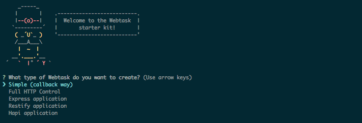

# generator-webtask

[](https://www.npmjs.com/package/generator-webtask)
[](https://david-dm.org/jcenturion/generator-webtask)
[](https://david-dm.org/jcenturion/generator-webtask#info=devDependencies)

### Yo Webtask - Webtask starter kit generator

We have written a Yeoman generator to help get you started with Webtasks.

## Install the Generator

Install Yeoman and the Webtask generator:

```bash
npm install -g yo generator-webtask
```

## Run Yo Webtask
The Yeoman generator will walk you through the steps required to create `webtask` prompting for the required information.

To launch the generator simply type:

```bash
yo webtask
```



## Generator Output

```
├── src/
│   ├── [taskname].js
├── .editorconfig
├── .gitignore
├── package.json
├── quickstart.md
├── README.md
```

#### Express Application

```
├── config/
│   ├── api.config.js
│   ├── default.config.js
│   ├── webtask.config.js
├── src/
│   ├── api.js
│   ├── server.js
│   ├── webtask.js
├── .editorconfig
├── .gitignore
├── gulpfile.js
├── package.json
├── quickstart.md
├── README.md
```

Note: For more information please read [Webtask API Boilerplate](https://github.com/AlejoFernandez/webtask-api-boilerplate)

## Issue Reporting

If you have found a bug or if you have a feature request, please report them at this repository issues section.

## License

This project is licensed under the MIT license. See the [LICENSE](LICENSE) file for more info.
